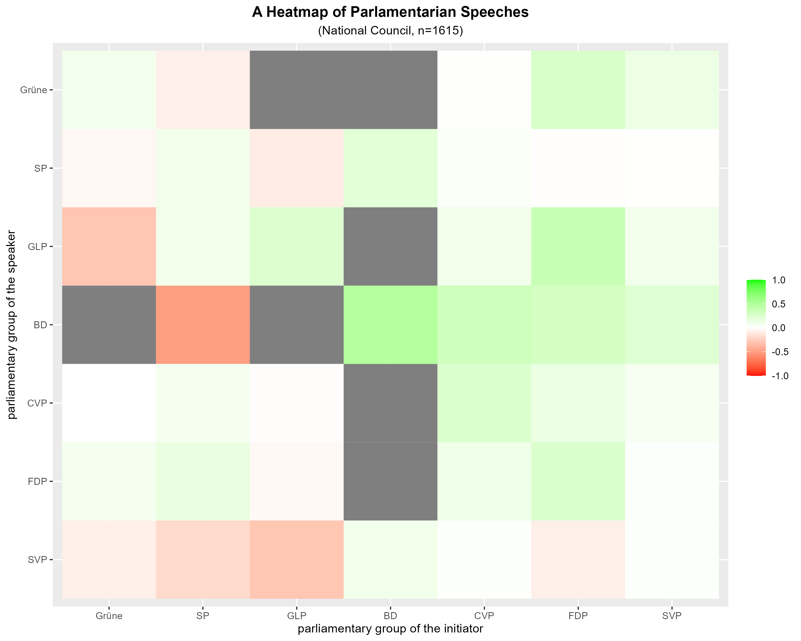
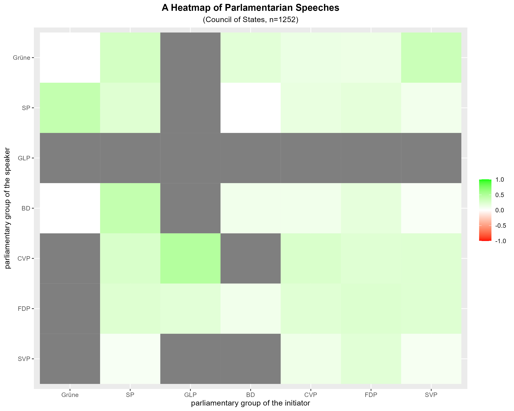
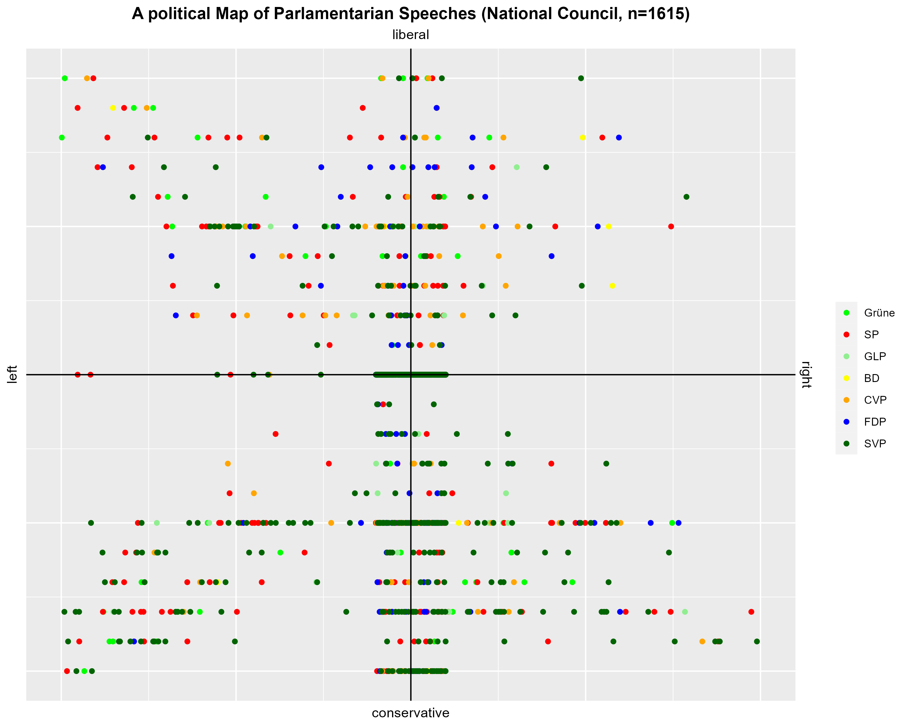
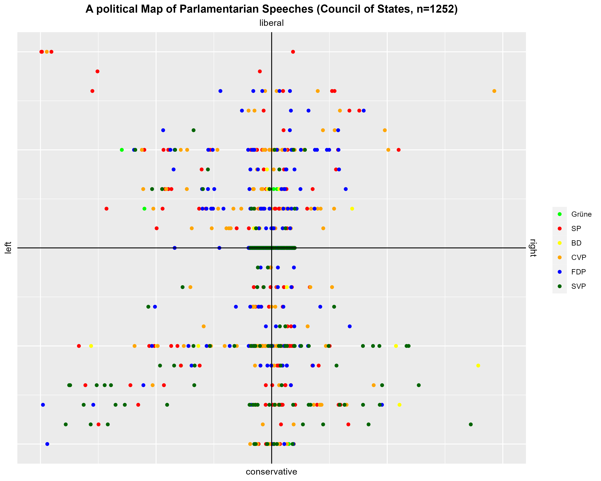
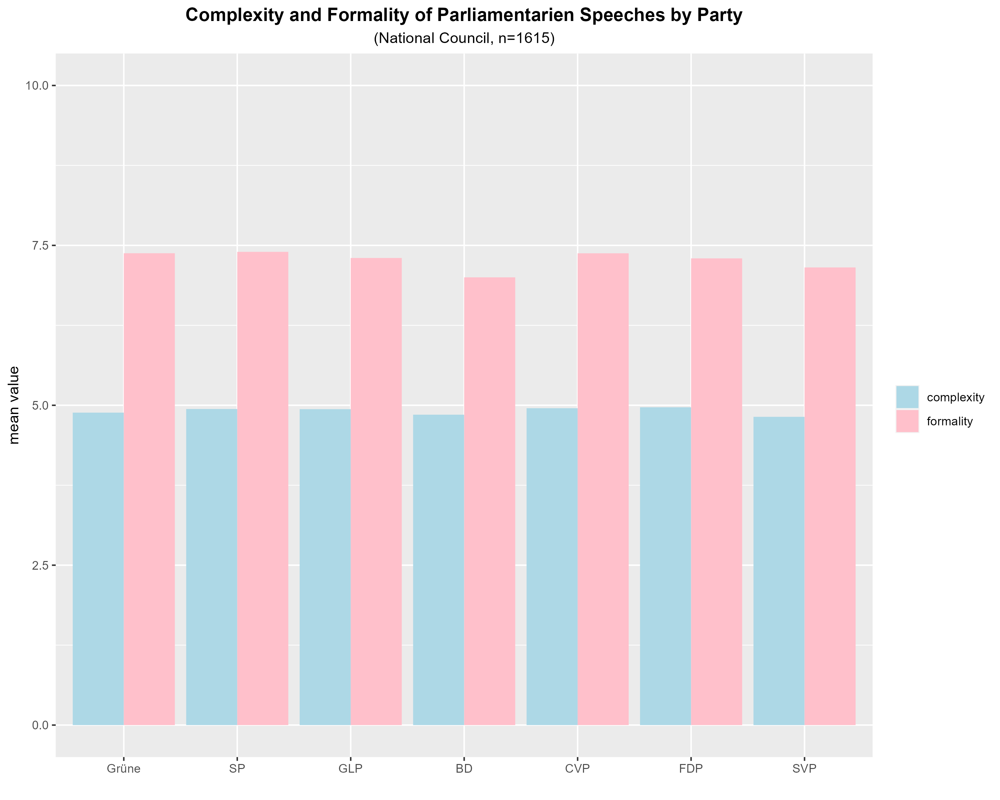
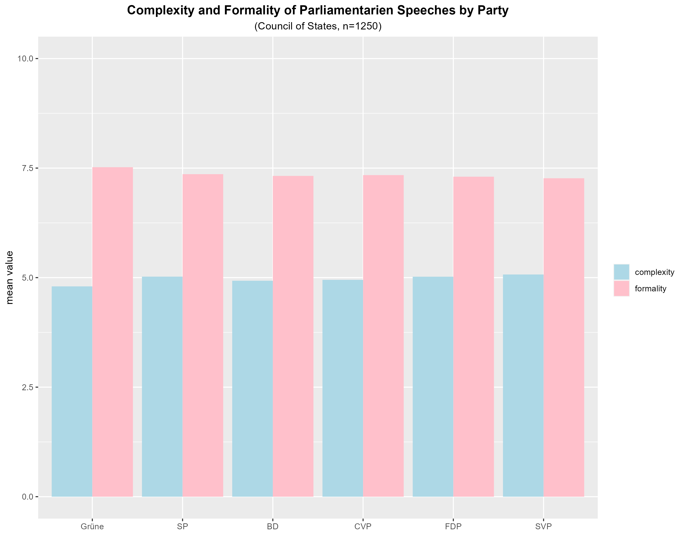

```{r setup, include=FALSE}
knitr::opts_chunk$set(echo = FALSE, warning = FALSE, message = FALSE)
```

## Introduction

In this capstone project, we were asked to develop an innovative and ambitious data mining project working with a reproducible workflow using RStudio projects and GitHub. Furthermore, working autonomously was expected.

In consultation with the lecturer, I decided to conduct a sentiment analysis of Swiss parliamentarian speeches using ChatGPT.

### Research Question

This project aims to analyse a limited number of Swiss parliamentarian speeches from the 50th legislation (30.11.2015 - 01.12.2019) and to visualize the results appealingly. The core of the project is a sentiment analysis using ChatGPT from OpenAI. The main questions of this analysis are:

**How positive or negative do politicians speak about the motions of politicians from the own or other parties?**

**How left or right and conservative or liberal are the statements about the motions and does it depend on the political party the politicians belong to?**

**How complex and formal is the use of language of politicians in their statements about motions and does it depend on the political party the politicians belong to?**

Due to time, monetary and computational power constraints, I limit my analysis on one legislation (50th) as well on one political instrument in the parliament (motion). With a motion, a member of parliament demands that the government prepares an amendment to the law, a resolution in accordance with federal law, or take a specific measures. This request is binding if the parliament agrees to it. The focus on this powerful instrument (where politicians are likely to choose their words even more wisely) therefore also makes sense from a political science point of view.

### Hypotheses

From basic political considerations, one would expect that politicians from different parties do not agree by large about political goals and/or tools. Hence, the following hypotheses can be made:

-While politicians from the same party are more likely to speak positive about their colleagues motions, politicians from different parties are much more likely to speak negatively about the motions of other politicians, especially if there is a large gap between the political opinions (e.g. left parties versus right parties).

-Politicians are likely to speak in accordance to their political opinions.

-However, such differences might also be influenced by the political system. For example, a politician in the National Council might not behave in the same way as a politician in the Council of States.

-If politicians select themselves into parties based on their social background or if party-membership fosters certain behavior, politicians might speak unequally complex and/or formal in their parliamentarian statements.

## Methods

The tasks that were necessary for this project can be split into five steps.

1) Scrape or retrieve data.
2) Clean and sort data.
3) Run sentiment analysis.
4) Clean data again and plot results.
5) Summarize the project in a report.

Regarding the first point, I was happy that scraping from the Swiss parliamentarian website (https://www.parlament.ch/en) itself was not necessary, as I could retrieve the data with the package 'swissparl' (https://github.com/zumbov2/swissparl). This R package is an interface to the new, still unofficial and accordingly still undocumented webservices of 'The Federal Assembly — The Swiss Parliament' that offer an open, machine-readable interface to the most important data on parliamentary activities. 

However, the almost non-existing documentation turned out to be a challenge, as several variables from different tables needed to be downloaded and merged. The technical part was though not a great challenge, but to find out which variable in which table matches with each other was sort of a greater deal, especially for the basic data which again was also an important input in the code to download the speeches afterwards. Furthermore, the basic data also contains information that was essential for the analysis I wanted to do (e.g. the party of the politician that initiated the motion).

Another challenge was the formulation of the message which was sent to ChatGPT. Especially if one demands ChatGPT to provide a number, it turns out that it can't always handle such requests and nevertheless delivers further information, generating additional data cleaning effort. Hence, a trial-and-error method was the best way to handle this challenge, and in the end the following messages were sent to ChatGPT.

**-RQ1: What is the sentiment of the following text using a number between -1 and 1? -1 is very negative, 1 is very positive. Please only print the number itself:**

**-RQ2: Analyse the following text regarding its political bias. Give me two numbers between -1 and 1. The first one should reflect if the text represents a politicially left (-1) or a polticially right (1) statement. The second one should reflect if the text represents a politicially conservative (-1) or a polticially liberal (1) statement. Please round the numbers to one decimal place first. Then only print the two numbers separated by a comma without any additional explanation.  It is very important that you only print the numbers. I do not want any sort of explanation at all. This is the text:**

**-RQ3: Analyze the following text regarding its complexity and formality. Give me for both factors a number between 0 and 10. The first number should reflect if the text is complex, the second number should reflect if the text is formal. Print only the two integer numbers separated by a comma without any additional explanation or other words. It is very important that you only print the numbers separated by a comma. I do not want any sort of explanation at all. This is the text:**

Furthermore, the sentiment analysis absorbed a remarkable amount of time, because the number of post-requests was limited to about three requests per minute. In total, my data set included almost 3000 speeches or statements, divided into two political chambers. As I conducted three sentiment analyses, this meant about 9000 requests or 50 hours computational time for the sentiment analysis only. An alternative option would have been to sent all research questions at the same time, however this was no real option because many messages would have become too long to be able to be processed by ChatGPT and the error rate would have definitelly been higher as well, making data cleaning again more intensive.

Conducting such a project therefore demands a 'small-step-procedure' and running tests in an early stage if the output was in the form it was supposed to be, as otherwise a lot of time is lost. It is also recommended to run the computational intensive codes during the night or at several computers at the same time. Another option is to execute different tasks at the same time, e.g. run the data retrieval code or sentiment analysis on one computer, while for example preparing the plots on another one.

One should also be aware that such an analysis with ChatGPT can become not only time but also costly moneywise, as OpenAI is no longer completely free. In total, this project costed about $10. 

## Results

The following plots visualize the results. While this part only contents the latter ones, the next part discusses them.

```{r, fig.show='hold',out.width='50%', fig.cap='Research question 1'}




```


```{r, fig.show='hold',out.width='50%', fig.cap='Research question 2'}




``` 


```{r, fig.show='hold',out.width='50%', fig.cap='Research question 3'}




``` 

## Discussion 

In the end, the application itself worked well. However, the results are to some extent surprising and hence one could doubt if the ChatGPT algorithm is really capable to run such an sentiment analysis or if the messages i.e. instructions that were sent to ChatGPT themselves were formulated well enough in the sense to get the most accurate results. 

## Conclusion

I would say that I learned a lot in this project. As mentioned above, the aim of this project was to autonomously develop an innovative and ambitious data mining project working with a reproducible workflow using RStudio projects and GitHub. Although the analysis as well as its results may come with a grain of salt, it was an interesting and instructive exercise from the technical point of view.

In a further project, I would definitely run the computational intensive codes at several computers at the same time and then merge the results from the different subsets together more often, as working with GitHub facilitates such an approach a lot. In a further project, I would definitely also spent more time to find out how ChatGPT gives the most accurate answers regarding the content of the sentiment analysis.
